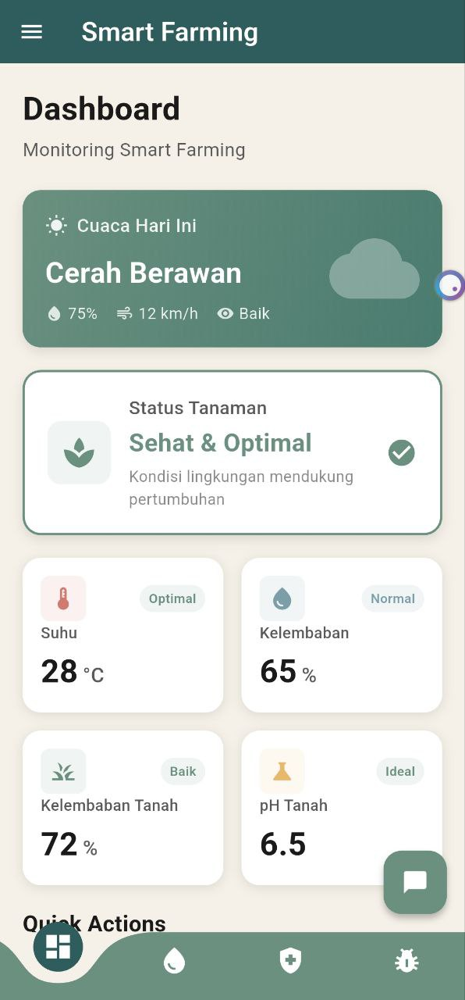

# 🌱 Smart Farming App

> Aplikasi Pertanian Pintar untuk Pengelolaan Lahan Secara Modern, Efisien, dan Terintegrasi

---

## 📱 Tentang Aplikasi

**Smart Farming** adalah aplikasi mobile yang memudahkan petani dan pengelola lahan untuk memantau dan mengontrol berbagai aspek pertanian mereka dari satu perangkat.

Aplikasi ini dilengkapi dengan teknologi terkini seperti:
- 🔐 **Autentikasi Aman** (Firebase Authentication)
- 📲 **Notifikasi Real-time** (Firebase Messaging)
- 🌐 **Sinkronisasi Cloud** (Cloud Database)
- 🤖 **AI untuk Deteksi Hama** (Machine Learning)

Sempurna untuk **proyek akademis, penelitian pertanian modern, atau implementasi sistem pertanian pintar di lapangan**.

---

## ✨ Fitur-Fitur Utama

### 1️⃣ 💧 Kontrol Pompa Air
Kelola sistem irigasi dengan mudah dari aplikasi:
- ✅ Nyalakan/matikan pompa **kapan saja**
- 🔄 Pilih antara mode **manual** (kontrol tangan) atau **otomatis** (berdasarkan sensor)
- 📊 Pantau status pompa secara real-time
- 🔌 Terintegrasi dengan sensor kelembapan tanah

**Manfaat:** Hemat air, efisien waktu, dan pastikan tanaman mendapat air yang cukup.

---

### 2️⃣ 🌦️ Monitoring Cuaca Real-time
Pantau kondisi cuaca lahan Anda setiap saat:
- 🌡️ **Suhu** - Tahu suhu udara saat ini
- 💨 **Kelembapan** - Monitor kelembapan untuk kontrol irigasi
- ☁️ **Kondisi Cuaca** - Cerah, mendung, atau hujan?
- 📍 **Lokasi Spesifik** - Data cuaca akurat untuk lahan Anda

**Manfaat:** Ambil keputusan lebih baik tentang kapan menyiram atau melindungi tanaman.

---

### 3️⃣ 🚜 Kontrol Peralatan Pertanian
Atur peralatan pertanian dari mana saja:
- 🎛️ Kontrol pembajak dan alat-alat pertanian lainnya
- 📌 Pantau status peralatan secara langsung
- ⏰ Jadwalkan operasi otomatis (akan berkembang)

**Manfaat:** Efisiensi pekerjaan, berkurang beban kerja fisik, kontrol penuh dari aplikasi.

---

### 4️⃣ ❤️ Monitoring Kesehatan Tanaman
Ketahui kondisi kesehatan tanaman Anda secara akurat:
- 🟢 **Status Sehat** - Tanaman berkembang dengan baik
- 🟡 **Status Waspada** - Mulai ada tanda-tanda masalah
- 🔴 **Perlu Tindakan** - Segera lakukan tindakan perbaikan

Berdasarkan data sensor lingkungan dan analisis cerdas.

**Manfaat:** Deteksi masalah lebih awal, selamatkan panen Anda.

---

### 5️⃣ 🐛 Deteksi Hama dengan AI
Identifikasi hama dan penyakit tanaman secara otomatis:
- 📸 Ambil foto tanaman yang bermasalah
- 🤖 AI akan menganalisis gambar secara otomatis
- 📋 Dapatkan hasil analisis dan rekomendasi tindakan
- 💡 Saran penanganan yang tepat untuk setiap masalah

**Manfaat:** Diagnosis cepat dan tepat, tangani masalah sebelum terlambat.

---

### 6️⃣ 🔔 Notifikasi Penting
Jangan lewatkan update penting:
- 📬 Notifikasi real-time untuk peringatan penting
- ⚠️ Alert jika ada masalah di lahan Anda
- 🎯 Fokus pada hal yang benar-benar penting

---

## 🛠️ Teknologi yang Digunakan

| Teknologi | Fungsi |
|-----------|--------|
| **Flutter** | Framework utama untuk aplikasi mobile |
| **Firebase** | Autentikasi & Messaging (notifikasi) |
| **REST API** | Komunikasi dengan server backend |
| **State Management** | BLoC/Cubit untuk manajemen data aplikasi |
| **IoT Integration** | Koneksi dengan sensor dan perangkat keras |
| **Machine Learning** | Deteksi hama berbasis AI |

---

## 📋 Persyaratan Sistem

Sebelum menjalankan aplikasi, pastikan Anda memiliki:
- **Flutter SDK** versi 3.9.2 atau lebih baru
- **Dart** versi 3.9.2 atau lebih baru (biasanya ikut dengan Flutter)
- **Android SDK** (untuk menjalankan di Android)
- **Xcode** (untuk menjalankan di iOS - hanya di Mac)

---

## 🚀 Cara Instalasi & Menjalankan

### 1️⃣ Clone atau Download Proyek
```bash
git clone <url-repository>
cd ptoject_akhir_kelas
```

### 2️⃣ Install Dependensi
Aplikasi memerlukan beberapa library. Download semua dengan perintah:
```bash
flutter pub get
```

### 3️⃣ Konfigurasi Firebase (Penting!)
Aplikasi ini menggunakan Firebase. Anda perlu:
1. Membuat project di [Firebase Console](https://console.firebase.google.com)
2. Download file konfigurasi Firebase
3. Letakkan di folder yang sesuai (sudah ada folder untuk ini)

### 4️⃣ Jalankan Aplikasi

**Di Android:**
```bash
flutter run
```

**Di iOS (hanya Mac):**
```bash
flutter run -d ios
```

**Di Web:**
```bash
flutter run -d chrome
```

---

## 📂 Struktur Folder Proyek

```
lib/
├── main.dart              # File utama aplikasi
├── pages/                 # Halaman-halaman aplikasi
├── cubit/                 # Logika state management
├── services/              # Layanan (Auth, Notifikasi, API)
├── models/                # Model data
├── widgets/               # Komponen UI yang bisa dipakai ulang
├── routes/                # Navigasi antar halaman
├── theme/                 # Warna, font, styling
└── firebase_options.dart  # Konfigurasi Firebase
```

---

## 🎯 Cara Menggunakan Aplikasi

### 1. Login / Daftar
- Buka aplikasi untuk pertama kali
- Daftar akun baru atau login dengan akun yang sudah ada
- Gunakan email dan password yang aman

### 2. Dashboard Utama
Setelah login, Anda akan melihat dashboard dengan:
- Status pompa air
- Data cuaca terkini
- Kesehatan tanaman
- Kontrol peralatan

### 3. Kontrol Pompa
- Tekan tombol untuk nyalakan/matikan pompa
- Pilih mode manual atau otomatis
- Pantau history penggunaan

### 4. Cek Kesehatan Tanaman
- Lihat status kesehatan dengan warna indikator
- Baca rekomendasi yang diberikan
- Ambil tindakan yang disarankan

### 5. Deteksi Hama
- Ambil foto tanaman
- Aplikasi akan menganalisis
- Terima rekomendasi penanganan

---

## 📞 Dukungan & Bantuan

Jika Anda mengalami masalah:
1. Periksa koneksi internet Anda
2. Pastikan Firebase sudah dikonfigurasi dengan benar
3. Lihat log error di terminal
4. Hubungi pengembang atau tim support

---

## 📝 Catatan Pengembang

Aplikasi ini masih dalam tahap pengembangan. Fitur-fitur berikut mungkin masih dikembangkan:
- ⚙️ Penjadwalan otomatis yang lebih canggih
- 📊 Laporan dan analisis lebih detail
- 🌐 Multi-user dengan role berbeda
- 📱 Sinkronisasi offline

---

## 📄 Lisensi & Kredit

Proyek ini dibuat untuk keperluan akademis. Silakan gunakan dan kembangkan sesuai kebutuhan Anda.

---

## ✅ Checklist Sebelum Menggunakan

- [ ] Flutter SDK sudah terinstall
- [ ] Firebase project sudah dibuat
- [ ] Konfigurasi Firebase sudah dilakukan
- [ ] `flutter pub get` sudah dijalankan
- [ ] Internet connection tersedia
- [ ] Device atau emulator sudah siap

---

**Selamat menggunakan Smart Farming App! 🌾 Semoga pertanian Anda semakin produktif dan efisien.**

## 🛠️ Teknologi yang Digunakan

* **Flutter** (Mobile Application)
* **Dart**
* **REST API**
* **IoT Devices** (ESP32 / Arduino)
* **AI / Machine Learning** (Deteksi Hama)
* **HTTP & JSON**
* **State Management** (Provider / Bloc / Riverpod)

---

## 📱 Preview Aplikasi

### 📊 Dashboard


### 🎛️ Pest Device


---

## 🧩 Arsitektur Sistem (High Level)

```
[ Flutter Mobile App ]
          |
       REST API
          |
[ Backend Server ]
          |
[ IoT Devices / AI Service ]
```

---

## 📂 Struktur Folder Project

```
lib/
├── pages/
│   ├── pump_page.dart
│   ├── weather_page.dart
│   ├── plow_page.dart
│   ├── plant_health_page.dart
│   └── pest_detection_page.dart
├── services/
│   ├── api_service.dart
│   └── pest_api_service.dart
├── routes/
│   └── BottomNavBar.dart
└── main.dart
```

---

## ⚙️ Cara Menjalankan Project

1. Clone repository:

   ```bash
   git clone https://github.com/username/smart-farming-flutter.git
   ```

2. Masuk ke folder project:

   ```bash
   cd smart-farming-flutter
   ```

3. Install dependency:

   ```bash
   flutter pub get
   ```

4. Jalankan aplikasi:

   ```bash
   flutter run
   ```

---

## 🎯 Rencana Pengembangan

* 🔔 Notifikasi otomatis (Firebase / Local Notification)
* 📊 Visualisasi grafik data sensor
* 🤖 Otomatisasi berbasis AI & Fuzzy Logic
* 🌐 Multi-device & multi-lahan
* 🔐 Autentikasi & manajemen pengguna

---

## 👨‍💻 Kontributor

* **Bagus** – Weather Pages 
  [](https://github.com/Bagus-DevLab)
* **Adit** - Pest Pages
  [](https://github.com/Adttt-dev)


---

## 📄 Lisensi

Project ini dikembangkan untuk **keperluan edukasi dan penelitian**.
Silakan digunakan, dimodifikasi, dan dikembangkan lebih lanjut.

---

🌾 *Smart Farming bukan soal teknologi mahal, tapi soal keputusan yang cerdas.*
